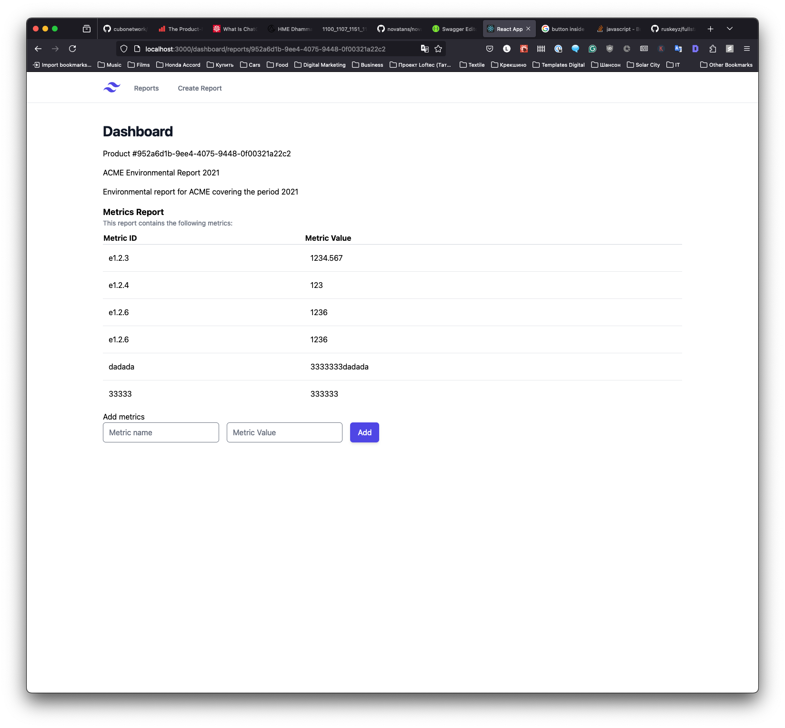

##  Fullstack Engineer Challenge

We're really excited that you'd like to join the engineering team at ! So we can see how you'd fit into our team, we'd like to get a feel for your technical and problem solving skills by asking you complete the following exercise.

We really appreciate you taking the time to work through this, but please limit yourself to no more than a few hours on the exercise. The intent of the exercise is not for you to complete all the tasks, what we're interested in is seeing how you think and approach working through the problem. 

## Preparation

Before starting this task, we recommend that you have:
- Your favourite computer and development tools to hand.
- A few hours of un-distracted time ahead of you.
- Access to the internet.
- A strong coffee (or mug of tea, if you prefer!).

## Exercise

In this repository, you will find a draft API contract for a simple RESTful service for collecting environmental report data. 

Your goal is to create a fullstack application that allows a user to complete and submit an environmental report. An environmental report is composed of some meta data, and the answers to 1 or more metrics. To help you along, there is an example schema for a report in the API contract.

Metrics are best thought of as the questions that a user can answer as they complete a report. There are many different environmental metrics that a user could answer whilst completing a report, and as the application grows more metrics will be added. The data type for each metric will vary, but generally they will be numbers, strings or booleans. Below is a table with some examples of the most popular metrics.

| Metric ID   | Type        | Description                 | Example value |
| :---        | :----:      | :----:                      |          ---: |
| e1.1.1      | number      | Scope 1 Emissions (tCO2e)   | 1234.56       |
| e1.2.1      | number      | Scope 2 Emissions (tCO2e)   | 1234.56       |
| e1.3.1      | number      | Scope 3 Emissions (tCO2e)   | 1234.56       |
| e1.4.1      | boolean     | Net-Zero Target             | yes           |

## Tasks

Clone this repository, and:

- [ ] Create a data model that can store environmental data in an efficient and extensible way, e.g tables for `Report`, `Metric`, etc.
- [ ] Create a simple backend service that implements the POST endpoint from the [report api](./api/report-service.yaml) and writes it to the data store.
- [ ] Create a simple frontend that allows the user to complete and submit an environmental report to your backend.

## Stretch Goals

If you find your self with time to spare, then feel free to improve your app. Below are some ideas...

- [ ] Extend the frontend and backend so that a user can view previously submitted reports.
- [ ] Extend the frontend and backend so that a user can edit previously submitted report.
- [ ] Extend the frontend and backend so that a user can delete a previously submitted report.

## Wrapping up

When you're finished, please:

1. Create a new README.md file within a `docs` folder with the instructions for how to run your code; and
2. Push your code back to repository as a new branch; and
3. Create a pull request.

Once we've received your pull request, we'll merge your code. Your submission will then be reviewed by our technical team and we will get back to you.

## Scaffolding

To help you get started, you'll find some basic scaffolding code within the repo. You're not expected to use this, so feel free to delete it or use something else, but it could be helpful to get you started.

We've provided you with:

- A basic server using Express with [BabelJS](https://babeljs.io) pre-configured and a basic test. See [`./server/README.md`](./server/README.md) for more info.
- A basic client using React created with [Create React App](https://create-react-app.dev/docs/getting-started/). See [`./client/README.md`](./client/README.md) for more info.
- A `.nvmrc` file to set the Node version using [NVM](https://github.com/nvm-sh/nvm). You can use a different Node version if you wish, the scaffolding has been created and tested using `v16.13.0`.
- A `docker-compose.yml` file to start a Postgres database.

## What will our engineers be looking for?
- A functioning solution with easy to follow instructions for running locally.
- A solid technical foundation that could grow into a full-scale production ready app.
- A well structured codebase and easy to read code that other engineers would be excited to work on.
- A database that accurately models the relationships and constraints, and can scale as the app grows.

## Some advice
- The exercise is purposely open-ended and there isn't a right or wrong answer. Just approach the problem the way you feel is right and you're free to use any technologies, frameworks or tools you like.
- Add comments where you can to communicate your thoughts, assumptions, decisions, etc. It’s helpful for us to learn about your thought processes when working through problems.
- Commit your progress regularly to your working branch so we can see how your thinking develops as you work.
- Feel free to use any technologies, frameworks and techniques you like.
- A more human readable way to view the API is to open the yaml file in [swagger's online editor](https://editor.swagger.io/).
- You are not necessarily expected to write tests but if this is how you would usually work then please do.
- Don’t be afraid to ask questions or ask for help if you need it.
